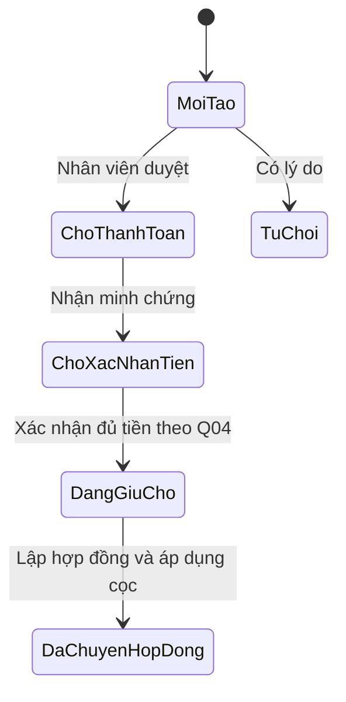

# SPEC — Cổng khách vãng lai: xem phòng, lịch xem và tiền giữ chỗ

- Ngày đối chiếu mã nguồn: 28/09/2026.
- Trạng thái: Đã triển khai các luồng theo quyết định D01–D07. Các chính sách còn mở tại mục 11 chưa được tự động hóa; xem kết quả kiểm chứng trong PLAN.
- Phạm vi người dùng đã xác nhận: giao diện khách, backend và các thao tác nhân viên cần thiết để hoàn thành toàn bộ luồng.
- Kế hoạch phát triển: [PLAN.md](PLAN.md).
- Tài liệu này kết nối [module phòng công khai/lịch xem](../phong-cong-khai-lich-xem/README.md) và [module khách vãng lai/giữ chỗ](../khach-vang-lai-giu-cho/README.md), không tạo module database thứ ba.

## 1. Mục tiêu và thuật ngữ

Khách tìm được phòng đang đăng công khai và xem thông tin, ảnh mà chưa cần đăng nhập. Muốn liên hệ trực tiếp, gửi lịch xem hoặc giữ chỗ/đặt cọc, khách phải đăng nhập. Khách gửi yêu cầu giữ chỗ trực tiếp hoặc từ lịch xem hợp lệ, chuyển tiền sau khi nhân viên duyệt và gửi ảnh minh chứng. Khách theo dõi xử lý đến khi tiền được áp dụng vào cọc hợp đồng hoặc có quyết định hoàn tiền.

Phân biệt trên giao diện:

- **Tiền giữ chỗ:** khoản nhân viên duyệt để giữ một phòng trước khi lập hợp đồng.
- **Tiền cọc hợp đồng:** nghĩa vụ tiền cọc của hợp đồng; chỉ tăng số tiền đã cấn trừ sau thao tác áp dụng tiền giữ chỗ hợp lệ.
- **Đã gửi minh chứng:** khách khai báo đã chuyển tiền; chưa đồng nghĩa đã nhận tiền.
- **Đã xác nhận tiền:** nhân viên đã đối chiếu và ghi giao dịch thực nhận.
- **Đã duyệt hoàn** và **đã hoàn thực tế:** hai thời điểm khác nhau, phải hiển thị riêng.

Không gọi hành động đầu tiên là “đã đặt cọc thành công”. Nút ban đầu dùng “Yêu cầu giữ chỗ”; màn hình thanh toán dùng “Chuyển tiền giữ chỗ”.

## 2. Căn cứ và nền tảng trước khi triển khai

Nguồn nền tảng: [spec schema ngày 21/09](../../superpowers/specs/2026-09-21-database-foundation-two-migrations-design.md) và [roadmap](../../roadmap-60-ngay.md).

| Thành phần | Có trong mã | Công việc còn thiếu |
| --- | --- | --- |
| Phòng công khai | `PhongTro.DuocDangTin`, `MaCongKhai`, `TieuDeDangTin`; `AnhPhongTro` | Service, store, trang công khai và quản lý đăng tin/gallery |
| Lịch xem | `KhungGioXemPhong`, `YeuCauXemPhong`, lịch sử trạng thái | Đặt lịch, duyệt lịch, quyền chi nhánh, khóa sức chứa trong transaction |
| Tài khoản khách | Domain có `Role.KhachVangLai = 3`, entity `KhachVangLai` | `AppRole` chưa có role mới; `UserAuthDto` chưa có `KhachVangLaiId`; đăng ký, claims và điều hướng chưa hoàn chỉnh |
| Giữ chỗ/tiền | Yêu cầu, minh chứng, giao dịch, áp dụng cọc, quyết định/giao dịch hoàn | Service thực hiện trạng thái, xử lý đồng thời và giao diện khách/nhân viên |
| Hạ tầng | Cookie, PostgreSQL, Cloudinary, VietQR, email, SignalR | Tích hợp riêng cho luồng khách vãng lai; bảo vệ ảnh tài chính |
| Kiểm thử | Có test model/schema và concurrency constraint | Cần test gọi service thật; ví dụ `ViewingScheduleServiceTests` hiện tự mô phỏng quy tắc trong test |

Bảng trên ghi hiện trạng tại lúc lập đặc tả. Migration nền `20260922163513_AddPublicViewingAndReservations` đã có trước tính năng này. Kết quả triển khai ngày 26/09, migration bổ sung và kiểm thử database nằm trong PLAN.

## 3. Phạm vi và lựa chọn kiến trúc

**Phương án đề xuất:** Razor MVC trong Area `KhachVangLai`, dùng layout công khai riêng, CSS/JavaScript riêng và Application Service. Cổng nhân viên bổ sung màn hình ở Area `QuanLyNhaTro`. Cách này phù hợp cookie authentication, Razor, Tabler/Bootstrap và bốn tầng hiện có.

**Phương án khác:** frontend SPA riêng và API version 1. Phương án này cần thêm build frontend, hợp đồng API và cơ chế xác thực nên không phải hướng kế hoạch hiện tại.

Trong phạm vi: đăng/ẩn tin và ảnh; danh sách/chi tiết; lịch xem; đăng ký/đăng nhập; giữ chỗ; chuyển khoản/minh chứng; đối chiếu; theo dõi; chuyển hợp đồng/cấn trừ cọc; quyết định và ghi nhận hoàn; thao tác nhân viên và kiểm thử liên luồng.

Chưa bao gồm ngân hàng tự động đối soát/webhook, ví điện tử, chữ ký số, mobile app, OCR minh chứng hoặc xây chatbot mới. Điểm tích hợp AI lịch xem phải đi qua cùng service đã kiểm tra quyền và sức chứa; AI không duyệt giữ chỗ, xác nhận tiền hoặc quyết định hoàn.

## 4. Tác nhân và quyền truy cập

| Tác nhân | Quyền cần có |
| --- | --- |
| Chưa đăng nhập | Xem danh sách và chi tiết tin công khai; nút liên hệ, hẹn xem và đặt cọc dẫn tới đăng nhập |
| KhachVangLai | Các quyền công khai và xem/thao tác trên lịch, giữ chỗ, minh chứng, thông tin hoàn của chính mình |
| NhanVien | Đăng tin, quản lý lịch, duyệt giữ chỗ và đối chiếu trong chi nhánh đang được phân công |
| Admin | Truy cập các chi nhánh và quyết định/ghi nhận hoàn tiền |
| KhachThue | Xem hợp đồng và lịch sử; tìm phòng khác, đặt lịch xem, gửi yêu cầu giữ chỗ và minh chứng bằng cùng tài khoản |

Server lấy người thao tác từ cookie/claims; tra hồ sơ qua `NguoiDungId` và quyền chi nhánh từ `NhanVienChiNhanh.IsActive`. Không nhận role, người duyệt hoặc chủ sở hữu từ form như một căn cứ phân quyền. Hủy phân công phải có hiệu lực ở request tiếp theo.

Lịch xem ẩn danh không được tự gắn vào tài khoản chỉ vì cùng số điện thoại/email hoặc vì người dùng biết ID. Không cung cấp tra cứu công khai thông tin liên hệ, minh chứng hoặc tài chính bằng ID tăng dần.

## 5. Màn hình và yêu cầu chức năng

### F01 — Danh sách và chi tiết phòng công khai

- Danh sách có lọc chi nhánh, khoảng giá, diện tích; phân trang. Trả ảnh bìa, tiêu đề, giá thuê, diện tích, sức chứa và trạng thái còn nhận yêu cầu.
- Chi tiết có gallery mọi ảnh đang `IsActive` theo thứ tự, nút ảnh trước/sau và ảnh thu nhỏ bấm để đổi ảnh; kèm mô tả, giá thuê/tháng và địa chỉ. Số điện thoại chi nhánh chỉ hiển thị sau đăng nhập.
- Chỉ công khai phòng `DuocDangTin = true`, phòng/chi nhánh chưa xóa, trạng thái `Trong` và không có giữ chỗ hoạt động. Phòng đã thuê, bảo trì hoặc đang giữ chỗ biến mất khỏi danh sách và đường dẫn chi tiết công khai; lịch sử của chủ sở hữu vẫn truy cập được sau đăng nhập.
- Không đưa thông tin người đang thuê, hợp đồng, ghi chú nội bộ hoặc ảnh minh chứng vào DTO công khai.
- Nút “Hẹn xem phòng”, “Đặt phòng và đặt cọc” cùng liên hệ; khi chưa đăng nhập, từng hành động chuyển tới trang đăng nhập chung và giữ đường dẫn quay lại nội bộ. Bước đặt cọc đầu tiên là gửi yêu cầu giữ chỗ, chưa phải chuyển tiền.
- Nhân viên được đăng/ẩn tin, tải tối đa 10 ảnh mỗi lần (mỗi ảnh tối đa 5 MB), quản lý ảnh/thứ tự/ảnh bìa trong chi nhánh mình. Mã công khai phải duy nhất; tối đa một ảnh bìa hoạt động cho mỗi phòng.
- Tin vừa bị ẩn phải bị chặn ở cả danh sách, đường dẫn chi tiết cũ và lúc gửi yêu cầu mới; hồ sơ lịch sử vẫn hiển thị cho chủ sở hữu.

### F02 — Gửi và xử lý lịch xem

- Họ tên và số điện thoại bắt buộc; email tùy chọn. Độ dài tối đa theo schema: 100/20/150 ký tự; ghi chú tối đa 1.000 ký tự.
- Chọn một khung giờ của đúng phòng hoặc nhập thời gian mong muốn trong tương lai. Khi chọn khung, service lấy thời gian bắt đầu từ server, không tin giá trị thời gian do client sửa.
- Trang và POST gửi lịch yêu cầu đăng nhập với role `KhachVangLai` hoặc `KhachThue`; yêu cầu mới gắn hồ sơ từ tài khoản hiện tại. `KhachVangLaiId` vẫn có thể null ở dữ liệu lịch ẩn danh cũ.
- Khung phải đang hoạt động, chưa qua giờ và còn sức chứa tại thời điểm transaction ghi lịch. Hai khách đặt suất cuối cùng không thể cùng được xác nhận.
- Thời gian khách đề xuất ngoài khung chờ nhân viên; khung cấu hình còn sức chứa tự xác nhận ngay. Khi khung vừa hết chỗ, yêu cầu không được tạo và khách chọn lại.
- Sau gửi, hiển thị xác nhận tiếp nhận. Khách xem các lịch thuộc tài khoản mình. Dữ liệu lịch ẩn danh cũ không được tự gắn theo số điện thoại/email.
- Nhân viên quản lý khung giờ theo từng phòng, sức chứa, người phụ trách; chốt thời gian, từ chối có lý do, đánh dấu đã xem hoặc hủy. Khi đổi lịch trên giao diện nhân viên, chọn từ danh sách khung giờ còn chỗ của đúng phòng; hệ thống kiểm tra lại sức chứa lúc lưu. Không giảm sức chứa thấp hơn số lịch còn hiệu lực.
- Quyền khách tự hủy/đổi lịch và thời hạn cho phép chờ Q07; mọi chuyển trạng thái lưu lịch sử.

### F03 — Đăng ký, đăng nhập và theo dõi tài khoản

- Đăng ký tạo `NguoiDung` và `KhachVangLai` trong cùng transaction; không tạo `NguoiThue` tại bước này.
- Tái sử dụng `IPasswordService`; mật khẩu không lưu/log dạng rõ. Role do server đặt thành `KhachVangLai`.
- Form đăng ký gồm tên đăng nhập, mật khẩu/nhập lại, họ tên, số điện thoại, email và CCCD. Email và CCCD bắt buộc có trong hồ sơ trước khi gửi yêu cầu giữ chỗ; không bắt buộc xác minh email hoặc số điện thoại.
- Tài khoản bị khóa/xóa không được thao tác; kiểm tra tên đăng nhập trùng cả khi hai đăng ký chạy đồng thời.
- Tích hợp `AppRole`, auth DTO, claim `KhachVangLaiId`, điều hướng sau đăng nhập và `returnUrl` nội bộ. Không đưa role mới vào dashboard quản trị mặc định.
- Sau chuyển thành khách thuê, truy vấn lịch sử giữ chỗ bằng liên kết người dùng cũ còn tồn tại, không chỉ dựa vào role `KhachVangLai`.

### F04 — Tạo, duyệt và theo dõi giữ chỗ

- Bắt buộc đăng nhập và hồ sơ có email, CCCD. Khách chọn phòng và gửi yêu cầu trực tiếp hoặc kèm `YeuCauXemPhongId` đã được kiểm tra chủ sở hữu, trạng thái đã xác nhận và cùng phòng.
- `SoTienGiuCho` cố định bằng 50% giá thuê tháng của phòng tại lúc duyệt (làm tròn đến đồng); nhân viên nhập `HanThanhToan` và `HanKyHopDong`.
- Lịch dùng làm nguồn phải thuộc chính tài khoản khách, cùng phòng và ở trạng thái `DaXacNhanLich`.
- `MoiTao` chưa khóa phòng. Duyệt sang `ChoThanhToan` phải kiểm tra phòng đủ điều kiện và không có giữ chỗ hoạt động; filtered unique index bảo vệ thêm.
- Ba trạng thái khóa phòng là `ChoThanhToan`, `ChoXacNhanTien`, `DangGiuCho`. Không thêm trạng thái `DangGiuCho` vào enum trạng thái phòng.
- Hiển thị mã yêu cầu, phòng, số tiền duyệt, tiền đã nhận, thời hạn, trạng thái, hành động tiếp theo và lịch sử xử lý.
- Khi nhân viên từ chối/hủy phải có lý do. Hủy giải phóng phòng theo quyết định, độc lập với tiến độ hoàn tiền.
- Nếu trong vòng 5 phút sau `HanThanhToan` khách chưa gửi minh chứng/chưa thực hiện thanh toán, yêu cầu cũ hết hạn và phòng không còn bị khóa; khách phải tạo yêu cầu mới để giữ/cọc tiếp. Nếu khách đã gửi ảnh minh chứng trước mốc này, phòng tiếp tục bị khóa đến khi nhân viên đối chiếu, kể cả khi đối chiếu sau hạn. Khi nhân viên từ chối minh chứng vì không có tiền hoặc tiền thiếu, phòng được nhả ngay. Xử lý tiền thực tế đến muộn vẫn cần làm rõ ở Q02. Không suy ra tiền bị mất chỉ từ trạng thái `HetHan`.

### F05 — Chuyển tiền, minh chứng và đối chiếu

- Yêu cầu thanh toán thuộc giữ chỗ đã duyệt; hiển thị số tiền, ngân hàng, tài khoản, tên người nhận, nội dung chuyển khoản, QR và hạn trả. Dùng một tài khoản nhận chung trong cấu hình ứng dụng; thiếu cấu hình thì không phát QR sai.
- Ảnh gửi kèm số tiền khai báo, thời điểm chuyển, mã giao dịch nếu có và ghi chú; không nhận URL ảnh do khách tự gán.
- Đề xuất kỹ thuật: JPEG/PNG/WebP, tối đa 5 MB/tệp, một ảnh mỗi lần gửi; xác thực nội dung tệp ở server, cho gửi bổ sung bằng bản ghi mới. Ảnh sai định dạng/lỗi upload không làm đổi trạng thái tiền.
- Gửi ảnh chỉ tạo minh chứng và trạng thái chờ đối chiếu. Chỉ nhân viên có quyền mới ghi `GiaoDichGiuCho.SoTienThucNhan`, mã giao dịch và thời điểm thực nhận.
- Xác nhận giao dịch, minh chứng, trạng thái thanh toán/giữ chỗ và lịch sử phải nguyên tử. Gửi lại cùng thao tác không tạo khoản thu thứ hai; dùng mã giao dịch và khóa bản ghi để chống trùng.
- Chỉ chấp nhận một giao dịch đủ số tiền giữ chỗ; không cộng dồn nhiều giao dịch chuyển thiếu. Tiền thừa, ảnh bị từ chối, chuyển sau hạn và cách xử lý đợt thanh toán tiếp theo còn chờ Q04; không tự coi thanh toán hóa đơn một phần là chính sách giữ chỗ.
- Ảnh tài chính chỉ được chủ sở hữu/nhân viên có quyền mở. URL Cloudinary công khai không đủ để bảo đảm yêu cầu này; cần storage riêng có tài nguyên được bảo vệ hoặc proxy có xác thực.

### F06 — Chuyển hợp đồng và áp dụng cọc

- Nhân viên tạo hợp đồng từ giữ chỗ đã xác nhận; xác minh cùng khách, cùng phòng, điều kiện thuê. Quá hạn ký không tự nhả phòng; nhân viên xác nhận xử lý thủ công trước khi ký quá hạn.
- Trong một transaction: tạo `NguoiThue` khi khách vãng lai chuyển vai trò, hoặc dùng lại `NguoiThue` hiện có khi người đặt đã là khách thuê; tạo hợp đồng, ghi áp dụng cọc đúng một lần, cập nhật giữ chỗ `DaChuyenHopDong` và trạng thái thuê phòng.
- Command chuyển giữ chỗ tạo hợp đồng/người thuê/phân bổ trong cùng transaction; giữ kiểm tra phòng, khách, điều khoản và tiền. Phát sinh hóa đơn tái sử dụng service/calculator hiện có. Tạo hoặc kích hoạt hợp đồng thông thường cũng phải chặn phòng đang giữ chỗ.
- Tổng tiền áp dụng không vượt cọc hợp đồng hoặc tiền thực nhận còn được phép phân bổ. Khoản cọc 50% được cấn trừ vào hóa đơn tháng bắt đầu hợp đồng; nếu lớn hơn hóa đơn, phần dư chuyển sang các hóa đơn tháng sau. Lưu phân bổ riêng, không ghi thêm một khoản thu ngân hàng giả.
- Hiển thị rõ tiền cọc hợp đồng, phần áp dụng từ giữ chỗ và phần cọc còn thiếu. Tiền dư hoặc tiền đã hoàn trước khi ký phải xử lý theo Q04.
- Khi đổi role sang `KhachThue`, làm mới phiên xác thực theo luồng hiện có; bảo toàn lịch sử khách vãng lai/giữ chỗ.

### F07 — Quyết định và thực hiện hoàn

- Một giữ chỗ có tối đa một quyết định hoàn; lưu số tiền duyệt, lý do, người và thời điểm quyết định. Số tiền duyệt có thể bằng 0 nhưng giao dịch hoàn thực tế phải lớn hơn 0.
- Một quyết định có thể có nhiều giao dịch hoàn; mỗi mã giao dịch hoàn duy nhất.
- Tổng hoàn thực tế không vượt số tiền duyệt hoặc tiền thực nhận chưa dùng vào cọc. Khóa cùng bản ghi giữ chỗ khi hoàn và cấn trừ để ngăn sử dụng hai lần một khoản tiền.
- Cần duy trì `tổng áp dụng cọc + tổng hoàn thực tế <= tổng tiền thực nhận`; số tiền đã được duyệt hoàn nhưng chưa chi cũng phải được giữ riêng khi xét áp dụng cọc.
- Trạng thái hoàn hiển thị theo enum riêng: `ChoHoanTien`, `DangHoanTien`, `DaHoanTien`, `DaHuy`, `KhongHoan`. Quyết định 0 đồng hiển thị “Không hoàn tiền”, không tạo giao dịch chi 0 đồng; xử lý sửa/hủy quyết định chờ Q03/Q04.
- Khách xem lý do, tiền duyệt, tiền đã hoàn, còn chờ hoàn và bằng chứng được phép xem. Không hiển thị “Đã hoàn” chỉ vì quyết định đã được duyệt.

## 6. Mô hình trạng thái và tính nhất quán

Luồng giữ chỗ chính dự kiến, tên lấy đúng enum hiện tại:

Các nhánh hủy, hết hạn, từ chối minh chứng và thanh toán thiếu không được thực thi chỉ dựa vào sơ đồ này; phải chốt bảng chuyển trạng thái sau Q02/Q04/Q07. Trạng thái giữ chỗ, yêu cầu thanh toán, minh chứng và hoàn tiền là bốn trạng thái riêng, phải trả về riêng trong DTO.

Khi đăng ký, duyệt suất cuối, duyệt giữ chỗ, xác nhận tiền, hết hạn, chuyển hợp đồng hoặc hoàn tiền: kiểm tra lại điều kiện trong transaction. Có thứ tự khóa thống nhất để tránh deadlock; duyệt giữ chỗ/lập hợp đồng cùng khóa phòng, thao tác tiền/hết hạn cùng khóa giữ chỗ. Unique/check constraints là lớp bảo vệ bổ sung, không thay cho kiểm tra nghiệp vụ.

## 7. Thiết kế giao diện

| Trang | Nội dung và hành động chính |
| --- | --- |
| Danh sách phòng | Bộ lọc, thẻ ảnh, giá, thông tin chính, phân trang, trạng thái không có kết quả |
| Chi tiết phòng | Gallery, thông tin, phí công khai, trạng thái, nút đặt lịch/giữ chỗ |
| Đặt lịch xem | Chọn khung hoặc thời gian khác, thông tin liên hệ, xác nhận tiếp nhận |
| Tài khoản | Đăng ký/đăng nhập, quay lại phòng hoặc yêu cầu đang xem |
| Yêu cầu của tôi | Hai danh sách lịch xem/giữ chỗ, trạng thái và hành động tiếp theo |
| Chi tiết giữ chỗ | Timeline, hạn thanh toán/ký, tiền duyệt/đã nhận, lý do, chi tiết cọc/hoàn |
| Thanh toán giữ chỗ | Thông tin ngân hàng/QR, sao chép nội dung, upload ảnh, trạng thái đối chiếu |
| Cổng nhân viên | Tin/ảnh, khung giờ, hàng đợi lịch, giữ chỗ, đối chiếu tiền, chuyển hợp đồng, hoàn tiền |

Giao diện tiếng Việt, tiền hiển thị VND, giờ hiển thị Việt Nam (UTC+7); database lưu UTC. Đề xuất kiểm tra ở chiều rộng 375 px và 1.280 px. Form giữ dữ liệu hợp lệ khi lỗi, có label và thông báo theo trường; trạng thái không chỉ phân biệt bằng màu. Bộ đếm thời gian chỉ hỗ trợ hiển thị, server quyết định hết hạn. Refresh sau thao tác không gửi POST lần nữa.

## 8. Ranh giới mã nguồn và tích hợp

- .NET 8, ASP.NET Core MVC/Razor, EF Core 8, PostgreSQL, xUnit; tái sử dụng Tabler/Bootstrap, cookie và các abstraction hiện có.
- Web chỉ dùng DTO/enum của Application; không tham chiếu Domain trực tiếp. Application không chứa EF Core, ASP.NET Core hoặc `IFormFile`.
- Feature mới đề xuất: `PhongCongKhais`, `LichXemPhongs`, `KhachVangLais`, `GiuChos`, mỗi feature tách `DTOs`, `Services`, `Persistence`; `GiuChos` thêm `UseCases` cho hết hạn/chuyển hợp đồng.
- Infrastructure hiện thực store dưới `Persistence/Features`; Web ở `Areas/KhachVangLai` và các controller/view mới trong `Areas/QuanLyNhaTro`.
- Theo phân công hiện có: B phụ trách luồng; A tích hợp thay đổi schema, `Program.cs`, DI và contract dùng chung. Kế hoạch phải ghi rõ các điểm bàn giao, không tạo đăng ký song song.
- Không sửa migration cũ. Nếu phát hiện cần unique username, lưu thông tin hoàn hoặc cơ chế xác minh mới, lập thay đổi schema riêng giao A review trước khi thực hiện.
- `IImageStorageService` hiện chỉ trả URL; gallery cần `PublicId`, ảnh tài chính cần quyền truy cập. Thêm contract storage chuyên biệt hoặc mở rộng qua bước tích hợp; không suy ra `PublicId` bằng cách cắt URL.
- Với thông báo lỗi, không lộ stack trace, connection string, thông tin khách khác hoặc URL ảnh tài chính.

## 9. Các giới hạn và kiểm soát cần có

- Kiểm tra quyền sở hữu/chi nhánh cho cả đọc dữ liệu, file ảnh và thao tác ghi; chống sửa ID trên request.
- POST phải có antiforgery; dữ liệu mô tả hiển thị được encode. Chống gửi form lặp và giới hạn tần suất đăng ký/đặt lịch, ngưỡng cấu hình được.
- Không tải tên/email/số điện thoại của khách khác vào trang công khai hoặc log chẩn đoán.
- Lỗi ngoài hệ thống như Cloudinary/email không được tạo khoản thu/cấn trừ/hoàn giả. Không giữ transaction database trong lúc upload file; có cơ chế dọn ảnh mồ côi nếu ghi DB thất bại.
- Lỗi cạnh tranh trả kết quả có thể hiểu được, ví dụ “Phòng vừa được giữ chỗ” hoặc “Khung giờ vừa đủ người”, không trả lỗi database thô.
- Dữ liệu lịch sử, minh chứng, giao dịch được bảo toàn; các thao tác thay đổi phải lưu tác nhân, thời điểm và lý do khi cần.

## 10. Tiêu chí nghiệm thu và liên kết kế hoạch

| ID | Kết quả phải kiểm chứng | Task trong PLAN |
| --- | --- | --- |
| AC01 | Tin ẩn/xóa không lọt danh sách hoặc link cũ; chỉ có ảnh đang hoạt động, không lộ dữ liệu riêng | T02 |
| AC02 | Khách chưa đăng nhập không mở/gửi được lịch; sau đăng nhập quay lại phòng đã chọn; slot sai phòng/quá giờ bị chặn; hai khách không chiếm cùng suất cuối | T03 |
| AC03 | Đăng ký tạo đúng một cặp người dùng/hồ sơ; role, claim và quyền sở hữu đúng; không tự nhận lịch ẩn danh bằng số điện thoại | T01, T03 |
| AC04 | Giữ chỗ bắt buộc đăng nhập; lịch nguồn cùng chủ/cùng phòng; hai nhân viên duyệt cùng phòng chỉ một thành công | T04 |
| AC05 | Ảnh chuyển khoản không tự xác nhận tiền; request lặp không thu trùng; ảnh riêng không truy cập trái phép | T05 |
| AC06 | Hết hạn, minh chứng chờ đối chiếu, tiền thiếu/thừa/đến muộn tuân theo câu trả lời Q02/Q04 | T05, T06 |
| AC07 | Chuyển hợp đồng và cấn trừ đúng một lần; rollback không để khách/hợp đồng/cọc dở dang | T07 |
| AC08 | Hoàn nhiều lần không vượt quyết định; hoàn và cấn trừ đồng thời không chi quá tiền thực nhận | T08 |
| AC09 | Nhân viên khác chi nhánh/đã thu hồi quyền bị chặn; khách không xem/sửa yêu cầu của người khác | T01–T08 |
| AC10 | Luồng thực tế hoạt động trên desktop/mobile, trạng thái và tiền nhất quán; cookie khách thuê cũ không bị hỏng | T09 |

## 11. Câu hỏi nghiệp vụ cần người dùng chốt

Không dùng các lựa chọn đề xuất dưới đây như câu trả lời. Task phụ thuộc câu hỏi phải đợi câu trả lời được cập nhật vào đặc tả.

Q01 chỉ còn liên quan đến lịch ẩn danh đã tạo trước thay đổi ngày 28/09/2026; lịch mới yêu cầu đăng nhập.

| Mã | Câu hỏi | Hướng đề xuất để lựa chọn | Bị ảnh hưởng |
| --- | --- | --- | --- |
| Q01 | Nhận lại lịch xem ẩn danh sau khi đăng ký bằng nhân viên xác minh, OTP hay không liên kết? Khách ẩn danh nhận thông báo/đổi lịch qua kênh nào? | Nhân viên xác minh rồi gắn hồ sơ; liên hệ qua số điện thoại đã để lại; không có trang tra cứu riêng theo ID | T03 |
| Q02 | Đã chốt: không gửi minh chứng/thanh toán sau hạn cộng 5 phút thì nhả phòng; ảnh gửi trước mốc đó giữ phòng đến khi nhân viên đối chiếu; từ chối đối chiếu tiền thiếu/không tìm thấy thì nhả ngay. Sau khi nhận đủ tiền, quá hạn ký vẫn giữ phòng đến khi nhân viên xử lý thủ công. Còn mở: tiền thật đến muộn. | Không tự xác nhận tiền chỉ từ ảnh; cần quyết định xử lý tiền đến muộn | T05, T06 |
| Q03 | Đã chốt: nhân viên có quyền chi nhánh và Admin được duyệt số tiền hoàn ở mức 0, một phần hoặc toàn bộ số tiền thực nhận. Còn mở: khách tự hủy sau khi trả tiền và sửa/hủy quyết định hoàn? | Bắt buộc lý do và giữ vết quyết định; không hoàn vượt tiền thực nhận | T06, T08 |
| Q04 | Đã chốt: một giao dịch phải đủ tiền giữ chỗ, không cộng dồn nhiều lần chuyển thiếu. Còn mở: xử lý tiền thừa, tiền đến sau hạn, ảnh bị từ chối và sửa/hủy quyết định hoàn? | Không xác nhận giữ chỗ từ các khoản thiếu; cần quyết định xử lý khoản thực nhận sai số | T05–T08 |
| Q05 | Đã chốt: đăng nhập tài khoản, có email và CCCD trước giữ chỗ; không bắt buộc xác minh email/điện thoại. Đăng nhập bằng tên đăng nhập hiện có. | Không thêm bước OTP/email xác minh | T01, T04 |
| Q06 | Đã chốt: phòng đang giữ chỗ, đã thuê hoặc bảo trì bị ẩn hoàn toàn khỏi danh sách, chi tiết công khai và lịch xem; chỉ phòng trống chưa có giữ chỗ hoạt động mới được công khai | Áp dụng cùng predicate ở tìm kiếm, xem chi tiết và thao tác đặt mới | T02, T03, T04 |
| Q07 | Đã chốt: khung giờ còn chỗ được tự xác nhận; thời gian khách đề xuất chờ nhân viên. Lịch nguồn để giữ chỗ phải là `DaXacNhanLich`. Còn mở: khách được hủy/đổi lịch đến lúc nào? | Kiểm tra sức chứa khung giờ trong transaction; không tự xác nhận đề xuất ngoài khung | T03, T04 |

## 12. Nhật ký quyết định và tự kiểm tra

- D01 — 25/09/2026: Người dùng chọn luồng hoàn chỉnh gồm giao diện khách, backend, thao tác nhân viên.
- D02 — 25/09/2026: Phòng giữ chỗ/đã thuê/bảo trì bị ẩn hoàn toàn; giữ chỗ chưa xác nhận tiền nhả phòng sau hạn chuyển khoản 5 phút; nhân viên có quyền chi nhánh và Admin được duyệt số tiền hoàn.
- D03 — 25/09/2026: Khi hết 5 phút mà khách chưa thanh toán, yêu cầu cũ không dùng để đặt cọc tiếp; khách phải thực hiện yêu cầu mới. Giao dịch ngân hàng đến muộn vẫn cần quy tắc đối chiếu riêng.
- D04 — 25/09/2026: Minh chứng gửi trước hạn cộng 5 phút giữ phòng đến lúc đối chiếu; từ chối tiền thiếu/không tìm thấy tiền thì nhả ngay.
- D05 — 25/09/2026: Tiền giữ chỗ cố định 50% giá thuê tháng, một giao dịch đủ tiền; ngân hàng nhận lấy từ cấu hình chung. Không có bước OTP; hồ sơ khách bắt buộc email và CCCD trước giữ chỗ.
- D06 — 25/09/2026: Nhân viên/Admin được chọn hoàn 0, một phần hoặc toàn bộ. Quá hạn ký khi đã nhận đủ tiền giữ phòng đến khi nhân viên xử lý thủ công.
- D07 — 25/09/2026: Cọc được trừ vào hóa đơn tháng bắt đầu hợp đồng. Nếu hóa đơn nhỏ hơn cọc, phần dư chuyển sang tháng sau.
- 26/09/2026: Đã có Application, Infrastructure, Razor UI khách/nhân viên và hai migration bổ sung. Kết quả kiểm thử, các khác biệt triển khai và giới hạn nằm trong PLAN và README.
- Đã đối chiếu tên entity, enum và giới hạn độ dài với mã nguồn; các thành phần mới trong PLAN đều ghi là đề xuất tạo mới.
- Đã phân biệt trạng thái mô tả trong test với hành vi service thực tế; không dùng số test cũ làm bằng chứng hoàn thành.
- Đã ghi rõ các khoảng trống auth/storage, cạnh tranh tài chính và trách nhiệm tích hợp A/B.
- Mỗi AC có task tương ứng; Q02/Q03 mới được chốt một phần, Q06 đã chốt, các câu còn lại cần người dùng trả lời nên tài liệu chưa được gắn trạng thái “đã chốt”.
