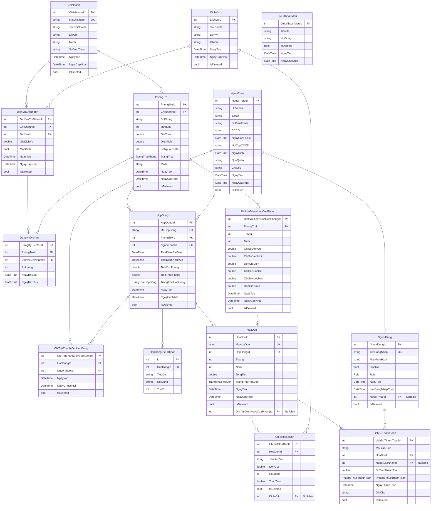

# LƯỢC ĐỒ QUAN HỆ THỰC THỂ (ERD) - HỆ THỐNG QUẢN LÝ THUÊ PHÒNG TRỌ

Tài liệu này mô tả chi tiết cấu trúc cơ sở dữ liệu (PostgreSQL) của hệ thống được lập bản đồ thông qua Entity Framework Core.

---

## 1. Lược đồ ERD (Mermaid.js)

---

## 2. Mô tả các Danh mục Enums của hệ thống

### 2.1. TrangThaiPhong
*   `Trong = 0`: Phòng còn trống, sẵn sàng cho thuê.
*   `DaThue = 1`: Phòng đã lập hợp đồng và có khách ở.
*   `BaoTri = 2`: Phòng đang bảo trì cơ sở vật chất.

### 2.2. Role (Vai trò tài khoản)
*   `Admin = 0`: Chủ nhà trọ / Quản trị viên hệ thống.
*   `NhanVien = 1`: Nhân viên quản lý chi nhánh.
*   `KhachThue = 2`: Người thuê phòng.

### 2.3. TrangThaiHopDong
*   `DangHoatDong = 1`: Hợp đồng đang trong thời hạn thuê.
*   `DaKetThuc = 2`: Hợp đồng đã hoàn tất và khách đã thanh lý phòng.
*   `DaHuy = 3`: Hợp đồng bị hủy bỏ trước thời hạn.

### 2.4. TrangThaiHoaDon
*   `ChuaThanhToan = 0`: Hóa đơn mới phát sinh chưa thu tiền.
*   `DaThanhToan = 1`: Hóa đơn đã được ghi nhận thu tiền đầy đủ.

### 2.5. PhuongThucThanhToan
*   `TienMat = 0`: Giao dịch trực tiếp bằng tiền mặt.
*   `ChuyenKhoan = 1`: Thanh toán qua chuyển khoản ngân hàng (VietQR).
