# SƠ ĐỒ TUẦN TỰ & HOẠT ĐỘNG: CÁC USE CASE HỆ THỐNG

Tài liệu này chứa toàn bộ mã nguồn vẽ **Sơ đồ tuần tự (Sequence Diagram)** và **Sơ đồ hoạt động (Activity Diagram)** của chức năng Đăng nhập và 4 Use Case cốt lõi. Sơ đồ hoạt động được thiết kế theo luồng ngang (`graph LR`) hoặc dọc tối giản (`graph TD`) để dễ theo dõi và đưa vào báo cáo.

---

## 1. USE CASE XÁC THỰC: ĐĂNG NHẬP HỆ THỐNG

### 1.1. Sơ đồ tuần tự (Sequence Diagram)
Sơ đồ mô tả luồng xác thực tài khoản qua hai tầng băm mật khẩu PBKDF2/SHA256, tự động nâng cấp độ bảo mật băm mật khẩu (Re-hash) và lưu phiên đăng nhập Cookie.

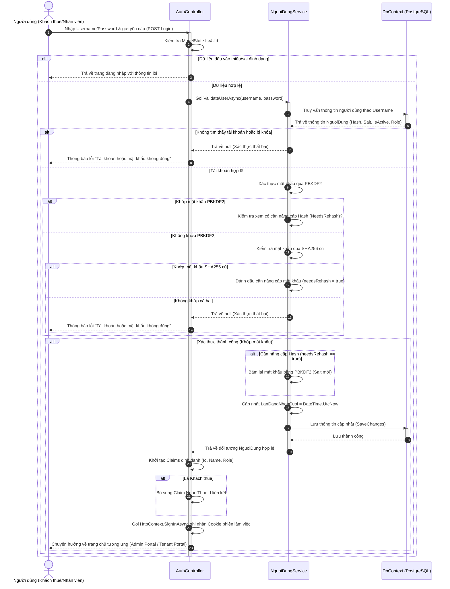

### 1.2. Sơ đồ hoạt động (Activity Diagram - Bố cục dọc tối giản)
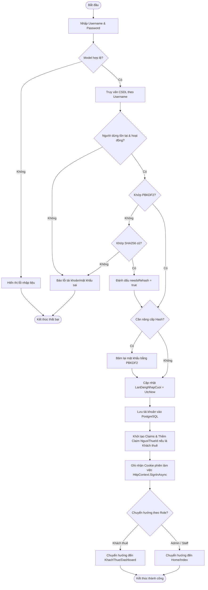

---

## 2. USE CASE 1: LẬP HỢP ĐỒNG THUÊ PHÒNG (UC-07)

### 2.1. Sơ đồ tuần tự (Sequence Diagram)
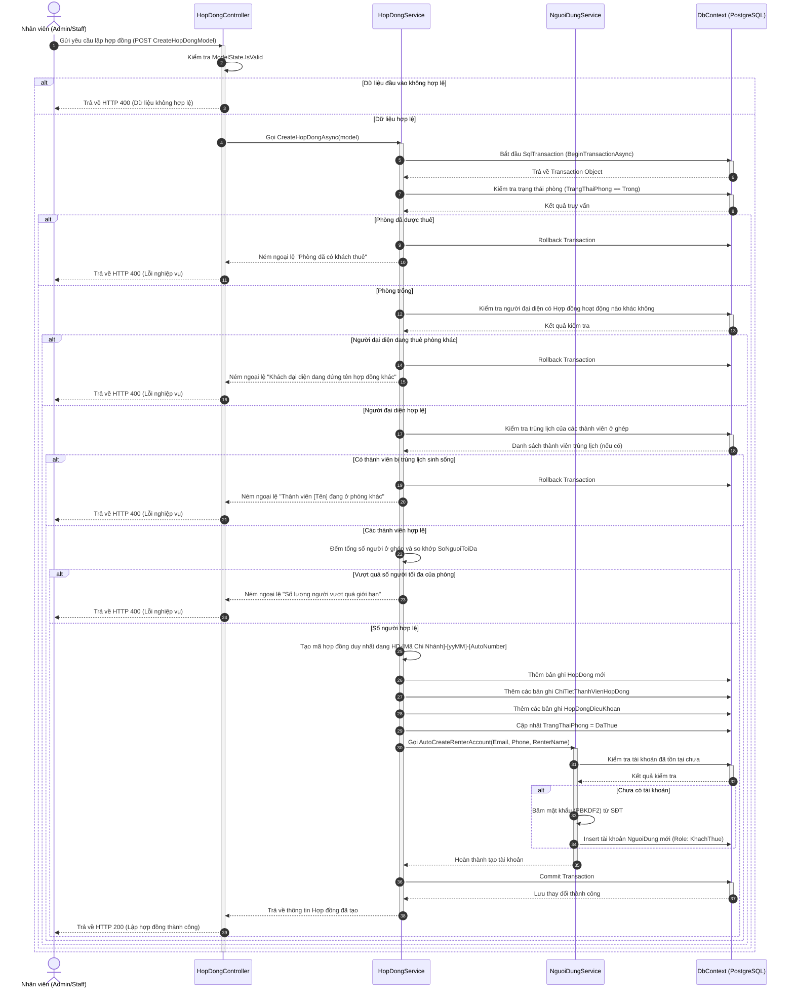

### 2.2. Sơ đồ hoạt động (Activity Diagram - Bố cục Ngang)
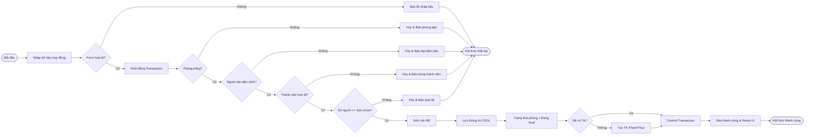

---

## 3. USE CASE 2: PHÁT SINH HÓA ĐƠN HÀNG LOẠT (UC-09)

### 3.1. Sơ đồ tuần tự (Sequence Diagram)
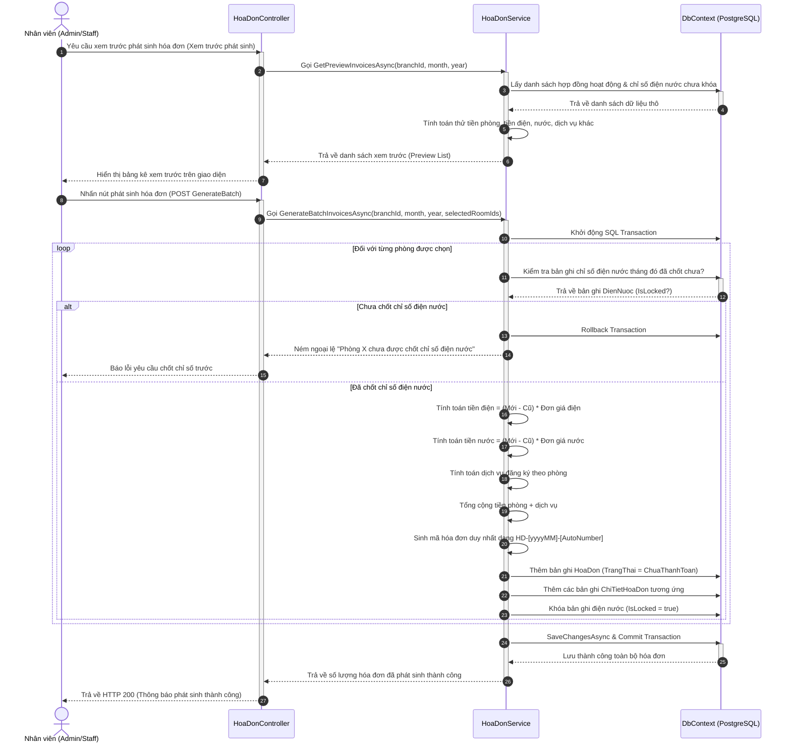

### 3.2. Sơ đồ hoạt động (Activity Diagram - Bố cục Ngang)
```mermaid
graph LR
    Start([Bắt đầu]) --> SelectBranch[Chọn chi nhánh/ngày]
    SelectBranch --> ClickPreview[Xem trước phát sinh]
    ClickPreview --> QueryPreview[Truy vấn dữ liệu preview]
    QueryPreview --> ShowPreviewTable[Hiển thị bảng kê]
    ShowPreviewTable --> SelectRooms[Tích chọn các phòng]
    SelectRooms --> ClickGenerate[Phát sinh hóa đơn]
    ClickGenerate --> StartTx[Bắt đầu SQL Transaction]
    
    StartTx --> LoopStart{Duyệt từng phòng}
    LoopStart -- Còn phòng --> CheckIndex{Đã chốt điện nước?}
    
    CheckIndex -- Chưa --> RollbackTx[Hủy giao dịch & Báo lỗi chốt chỉ số]
    RollbackTx --> EndFail([Kết thúc thất bại])
    
    CheckIndex -- Có --> CalcBill[Tính toán tổng tiền hóa đơn]
    CalcBill --> GenerateCode[Sinh mã hóa đơn độc nhất]
    GenerateCode --> InsertInvoice[Lưu hóa đơn và chi tiết vào CSDL]
    InsertInvoice --> LockIndex[Khóa chỉ số IsLocked = true]
    LockIndex --> LoopStart
    
    LoopStart -- Hết phòng --> SaveDb[Lưu thay đổi CSDL & Commit Transaction]
    SaveDb --> ShowSuccess[Thông báo thành công]
    ShowSuccess --> EndSuccess([Kết thúc thành công])
```

---

## 4. USE CASE 3: GHI NHẬN THU TIỀN - QUÉT MÃ VIETQR (UC-09)

### 4.1. Sơ đồ tuần tự (Sequence Diagram)
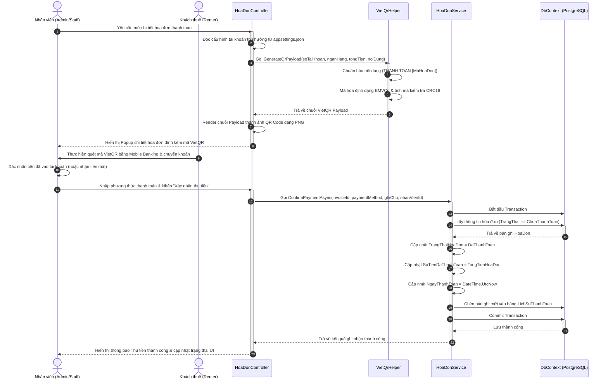

### 4.2. Sơ đồ hoạt động (Activity Diagram - Bố cục Ngang)
```mermaid
graph LR
    Start([Bắt đầu]) --> SelectInvoice[Chọn hóa đơn thu tiền]
    SelectInvoice --> CheckStatus{Chưa thanh toán?}
    
    CheckStatus -- Không --> BlockPayment[Báo lỗi: HĐ đã trả]
    BlockPayment --> EndFail([Kết thúc thất bại])
    
    CheckStatus -- Có --> ReadConfig[Đọc thông tin ngân hàng]
    ReadConfig --> BuildPayload[Tạo VietQR EMVCo & CRC16]
    BuildPayload --> RenderQR[Render QR hiển thị popup]
    RenderQR --> WaitScan[Khách quét QR & chuyển khoản]
    WaitScan --> ConfirmReceipt{Nhận đủ tiền?}
    
    ConfirmReceipt -- Không/Hủy --> EndFail
    ConfirmReceipt -- Có --> SelectMethod[Chọn phương thức/ghi chú]
    SelectMethod --> ClickConfirm[Nhấn Xác nhận thu tiền]
    ClickConfirm --> StartTx[Khởi tạo Transaction]
    StartTx --> UpdateInvoice[Cập nhật status = DaThanhToan]
    UpdateInvoice --> InsertHistory[Ghi lịch sử thanh toán]
    InsertHistory --> CommitTx[Commit Transaction]
    CommitTx --> ShowSuccess[Thông báo thành công & in biên lai]
    ShowSuccess --> EndSuccess([Kết thúc thành công])
```

---

## 5. USE CASE 4: TỰ ĐỘNG QUÉT VÀ GỬI EMAIL NHẮC NỢ (UC-15)

### 5.1. Sơ đồ tuần tự (Sequence Diagram)
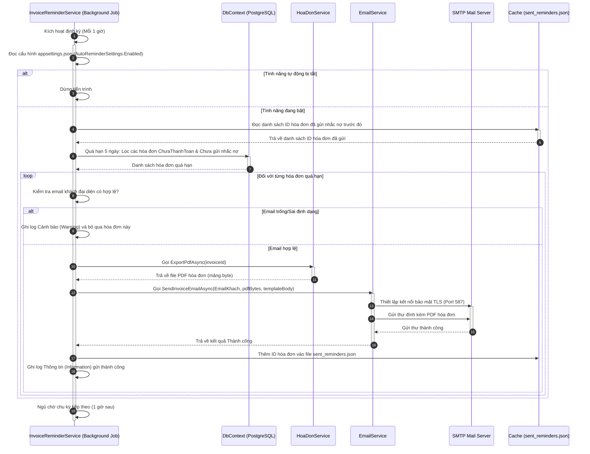

### 5.2. Sơ đồ hoạt động (Activity Diagram - Bố cục dọc tối giản)
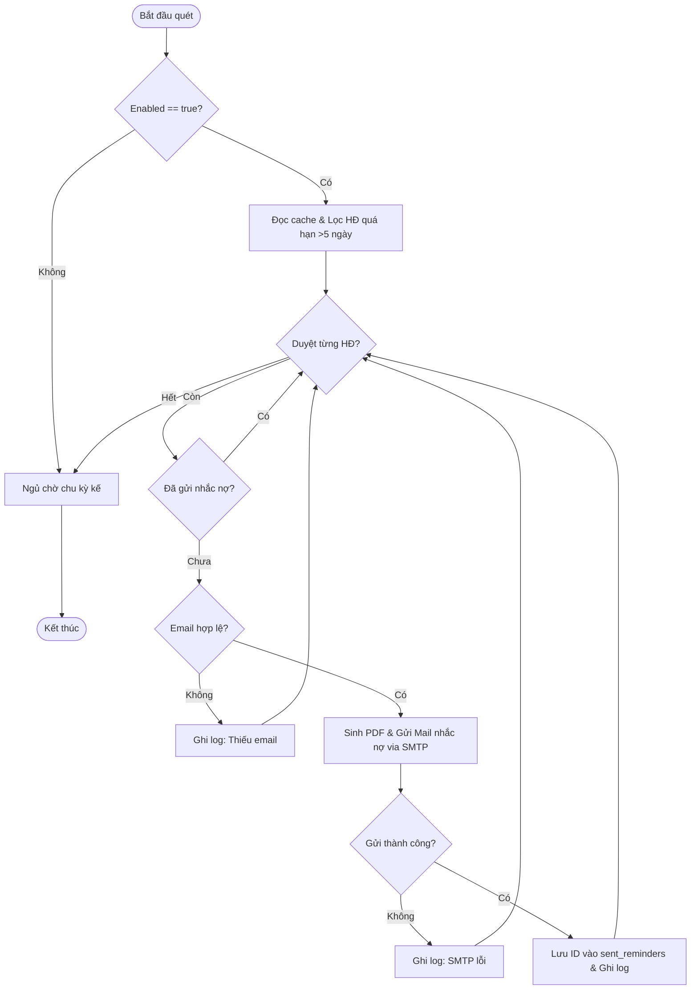

---

## 6. USE CASE 5: QUẢN LÝ SỰ CỐ & SỬA CHỮA (UC-16)

### 6.1. Luồng Khách Thuê Báo Cáo Sự Cố

#### 6.1.1. Sơ đồ tuần tự (Sequence Diagram)
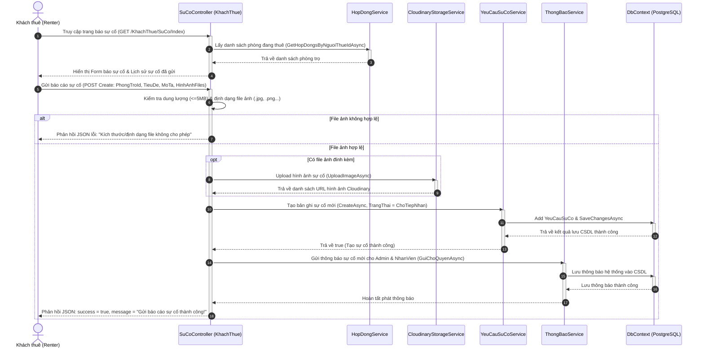

#### 6.1.2. Sơ đồ hoạt động (Activity Diagram - Bố cục Ngang)
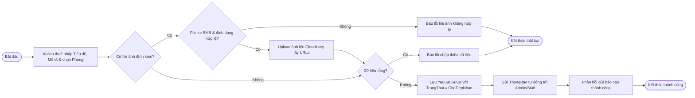

---

### 6.2. Luồng Admin Tiếp Nhận & Xử Lý Sự Cố

#### 6.2.1. Sơ đồ tuần tự (Sequence Diagram)
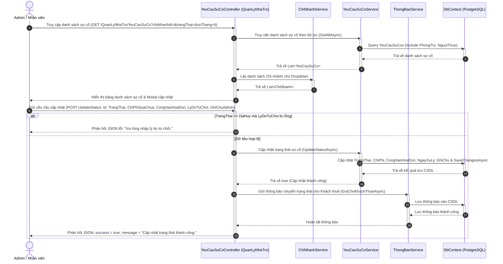

#### 6.2.2. Sơ đồ hoạt động (Activity Diagram - Bố cục Ngang)
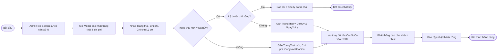

