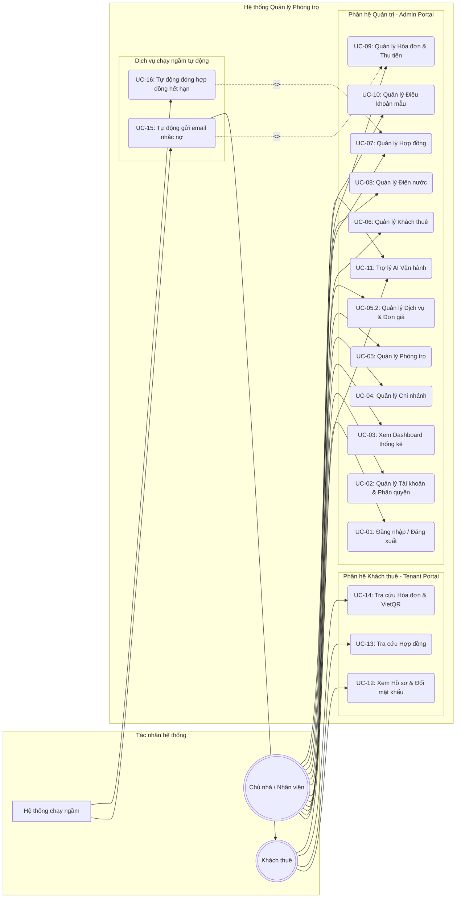

# TÀI LIỆU TỔNG QUAN HỆ THỐNG & ĐẶC TẢ USE CASE TỔNG THỂ

Tài liệu này cung cấp cái nhìn toàn diện về hệ thống **Quản lý cho thuê phòng trọ (Rental Management System)** và sơ đồ Use Case tích hợp toàn bộ các phân hệ chức năng.

---

## 1. Đánh giá Tổng quan về Hệ thống

Hệ thống được phát triển theo kiến trúc **ASP.NET Core MVC** chia vùng (Areas), kết nối cơ sở dữ liệu **PostgreSQL** thông qua **Entity Framework Core**. Hệ thống bao gồm hai phân hệ tương tác độc lập nhưng đồng bộ về dữ liệu:

1.  **Phân hệ Quản trị (Admin Portal - Area `QuanLyNhaTro`)**: Dành cho **Chủ nhà** và **Nhân viên**. Tập trung vào các tác vụ cấu hình hệ thống, quản lý vận hành (phòng, sơ đồ, khách thuê, hợp đồng) và quản trị tài chính (chốt số điện nước, phát sinh hóa đơn, sinh mã VietQR, ghi nhận thu tiền, quản lý công nợ).
2.  **Phân hệ Khách thuê (Tenant Portal - Area `KhachThue`)**: Giao diện gọn nhẹ dành riêng cho **Khách thuê** để tra cứu hợp đồng, theo dõi lịch sử tiêu thụ điện nước, bảng kê chi tiết hóa đơn hàng tháng và quét mã QR chuyển khoản thanh toán nhanh.
3.  **Hệ thống chạy ngầm tự động (Background Jobs)**: Các tác vụ nền chạy độc lập theo lịch biểu để tối ưu hóa nhân lực:
    *   *InvoiceReminderService*: Quét nợ hóa đơn và gửi email nhắc nợ tự động kèm file PDF hóa đơn.
    *   *ContractAutoCloseJob*: Tự động đóng hợp đồng hết hạn và giải phóng phòng về trạng thái trống.

---

## 2. Sơ đồ Use Case Tổng thể hệ thống (Mermaid)

